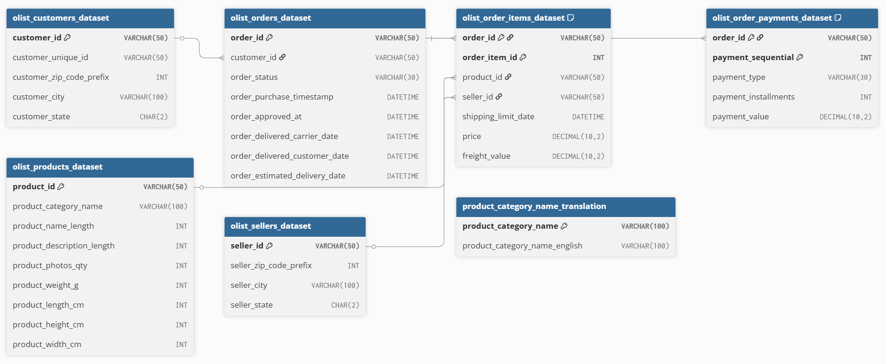

# 🛒 E-Commerce Business Insights — SQL & Power BI

Delivering Actionable Analytics Across Finance, Product, Customer, and Order Fulfillment using Advanced SQL and AI-Powered Power BI Dashboards

## Business Context

This project simulates a real-world e-commerce analytics use case, using SQL to extract stakeholder-relevant insights from a normalized, multi-table transactional dataset and Power BI to transform those insights into an interactive dashboard with KPIs, filters, trend analysis, and AI-assisted analytical visuals. The underlying data is a real, anonymized e-commerce marketplace transaction dataset (Olist, Brazil, 2016–2018).

## Table of Contents

- [About the Project](#about-the-project)
- [Business Domains Covered](#business-domains-covered)
- [Database Schema](#database-schema)
- [Entity Relationship Diagram](#entity-relationship-diagram)
- [Power BI Dashboard](#power-bi-dashboard)
- [Tools & Technologies](#tools--technologies)
- [Methodology Notes](#methodology-notes)
- [Key Stakeholder Insights](#key-stakeholder-insights)
- [Query Bank Summary](#query-bank-summary)
- [Getting Started](#getting-started)
- [Author](#author)

## About the Project

This project has two layers. The **SQL layer** focuses on extracting stakeholder-relevant insights from transactional data using advanced SQL techniques — CTEs, window functions, and subqueries. The **Power BI layer** transforms those insights into an interactive dashboard with KPIs, filters, trend analysis, and AI-assisted analytical visuals (Key Influencers and AI-generated narrative summaries), so findings are usable by both a technical and non-technical stakeholder audience.

## Business Domains Covered

- **Finance & Revenue** — total revenue, payment method mix, monthly trends
- **Product Analytics** — category/product revenue, top sellers, pricing patterns
- **Customer Analytics** — repeat purchase rate, spend-based segmentation, RFM scoring
- **Order & Business Performance** — delivery time, order status, regional performance, seller ranking

## Database Schema

Real Olist marketplace tables, joined across customers, orders, order items, payments, products, sellers, and category:

| Table Name                          | Description                                                          |
| ------------------------------------ | --------------------------------------------------------------------- |
| `olist_customers_dataset`           | Customer ID and location (city, state)                               |
| `olist_orders_dataset`              | Order status and timestamps (purchase, delivery, estimated delivery) |
| `olist_order_items_dataset`         | Line items per order — product, seller, price                        |
| `olist_order_payments_dataset`      | Payment type, installment count, and value per order                 |
| `olist_products_dataset`            | Product category and attributes                                      |
| `olist_sellers_dataset`             | Seller ID and location                                               |
| `product_category_name_translation` | Maps Portuguese category names to English                            |

All monetary values are in **Brazilian Real (R$)**.

## Entity Relationship Diagram

See [`Schema/`](Schema/) for the table creation scripts.

## Power BI Dashboard

An interactive 3-page Power BI dashboard built on top of the same SQL-modeled data, combining standard KPI/trend visuals with Power BI's AI visuals (Key Influencers and Smart Narrative).

### 1. AI-Powered E-Commerce Insights (Overview)

- Top-level KPIs: **Revenue R$16.0M**, **Orders 99.4K**, **Customers 96.1K**, **Repeat Customer Rate 3.12%**
- A dynamic **Business Alert** visual flags that customer retention remains low, directly surfacing the same finding as the SQL repeat-purchase-rate query for a non-technical audience.
- **Key Influencers visual** identifies what drives revenue upward: orders from customers in **São Paulo (SP)** increase average revenue by **R$254.5K**, `delivered` order status by **R$155.1K**, and `credit_card` payments by **R$84.31K** — an AI-generated confirmation of patterns also found manually via SQL joins/aggregation.

### 2. Product & Customer Intelligence

- Interactive filters for **Product Category**, **Customer State**, and **Payment Type**.
- **Revenue by Category** and **Top Products** bar charts for inventory/marketing prioritization.
- **Revenue by Payment Type** donut: credit card **78.34% (R$12.54M)**, boleto **17.92% (R$2.87M)**, voucher **2.37% (R$0.38M)**, plus debit card and undefined — matching the SQL Finance file's payment-mix findings exactly.
- A second Key Influencers panel scoped to product-level revenue drivers.

### 3. AI Revenue Intelligence

- Monthly revenue trend line, Sept 2016 – Oct 2018.
- Power BI's **Smart Narrative** visual auto-generates the written summary: peak revenue of **R$1.19M in Nov 2017** (7.46% of total revenue), lowest at **R$19.62 in Dec 2016**, with strong overall growth through 2017 — corroborating the SQL monthly-revenue-trend query.

## Tools & Technologies

- SQL Server Management Studio (SSMS)
- Microsoft SQL Server
- Power BI Desktop (Key Influencers & Smart Narrative AI visuals)
- Dataset: [Olist Brazilian E-Commerce Public Dataset](https://www.kaggle.com/datasets/olistbr/brazilian-ecommerce)
- GitHub

## Methodology Notes

- **Revenue filtering:** revenue and business-performance queries filter to `order_status = 'delivered'`, since cancelled/unavailable orders aren't realized revenue. Operational queries (status distribution, delivery time) intentionally include all statuses, since that's what they're measuring.
- **Product/category revenue** is calculated from `order_items.price` (item-level sale price), not `order_payments.payment_value`. Payments are recorded per order and can span multiple installments — joining them directly to line items would double-count revenue on multi-item orders. Payment-level totals are used only for whole-order/business-wide revenue (Finance file), never for per-product attribution.
- **Average Order Value** is computed by first aggregating payments per order in a CTE, then averaging — not by averaging raw payment rows, which conflates installments with orders.
- **The Power BI data model mirrors the SQL layer's logic** (same delivered-only filtering, same item-level revenue basis), so KPI figures match between the two layers rather than diverging due to different aggregation rules.

## Key Stakeholder Insights

### Finance

- Total revenue generated: **R$16,008,872.12 (R$16.0M)** across the full dataset.
- **Credit card is the dominant payment method** — ~76,800 transactions, contributing **78.34%** of total revenue (R$12.54M); Boleto is second at **17.92%** (R$2.87M).
- Monthly revenue shows strong growth through 2017, peaking at **R$1.19M in November 2017**, before data coverage drops off in late 2018.

### Product Analytics

- A small number of products generate a disproportionate share of revenue within each category — useful for inventory and marketing prioritization.
- Certain categories carry meaningfully higher average selling prices, indicating a premium-vs-volume split worth different pricing/marketing strategies.
- Revenue is concentrated among a small subset of top sellers, useful for vendor relationship prioritization.

### Customer Analytics

- Out of **96.1K unique customers** and **99.4K orders**, the **repeat customer rate is only 3.12%** — retention, not acquisition, is the biggest growth lever, and is flagged as a live Business Alert on the dashboard.
- Customer value segmentation shows most customers fall into the low-spend tier, while a small high-value segment contributes disproportionately to revenue.
- **RFM segmentation** identifies a top "555" segment (recent, frequent, high-spending) as the highest-priority group for retention investment.

### Order & Business Performance

- **97% of orders were successfully delivered**, indicating a reliable fulfillment process; under 1% were cancelled.
- Average delivery time is ~12 days; **~8% of orders arrive later than the estimated delivery date**.
- **São Paulo (SP)** is the largest single market by order volume, and being an SP customer is the single strongest positive revenue driver identified by the AI Key Influencers visual (+R$254.5K).
- Delivery performance varies significantly by state — fastest in São Paulo, slowest in more remote states — highlighting regional logistics opportunities.

## Query Bank Summary

| Domain                       | Basic | Intermediate | Advanced | Total  |
| ----------------------------- | ----- | ------------ | -------- | ------ |
| Finance                      | 2     | 2            | 2        | 6      |
| Product Analytics            | 2     | 3            | 2        | 7      |
| Customer Analytics           | 2     | 2            | 1        | 5      |
| Order & Business Performance | 1     | 7            | 3        | 11     |
| **Total**                    | **7** | **14**       | **8**    | **29** |

### SQL Techniques Used

| File                                    | Techniques                                                                  |
| ---------------------------------------- | --------------------------------------------------------------------------- |
| `01_Finance.sql`                        | Aggregation, Joins, CTEs, percent-of-total window calculation               |
| `02_Product_Analytics.sql`              | Joins across 3–4 tables, `HAVING`, `RANK() OVER (PARTITION BY ...)`         |
| `03_Customer_Analytics.sql`             | CTEs, `CASE`-based segmentation, `NTILE()` for RFM quintile scoring         |
| `04_Order_Analytics.sql`                | `DATEDIFF()`, `SUM() OVER()` for percentage distribution, regional grouping |
| `05_Business_Performance_Analytics.sql` | CTEs, `RANK()`, `SUM() OVER()` for revenue share, multi-table joins         |

## Getting Started

1. Clone the repo
2. Open SSMS and create a new database
3. Run the schema script in [`Schema/`](Schema/) to create all 7 tables
4. Import the CSVs from [`Dataset/`](Dataset/) into their matching tables (see import order/notes if using foreign keys)
5. Run each file in [`Queries/`](Queries/) in order — `01_Finance.sql` through `05_Business_Performance_Analytics.sql`
6. Open [`E-Commerce_Dashboard.pbix`](Power%20Bi/) in Power BI Desktop to explore the interactive dashboard, or view the screenshots/demo above
7. Refer to the Key Stakeholder Insights above alongside each query's inline business insight comment

## Author

**Shreya Bajpai**

Aspiring Data Analyst | SQL | Python | Power BI
